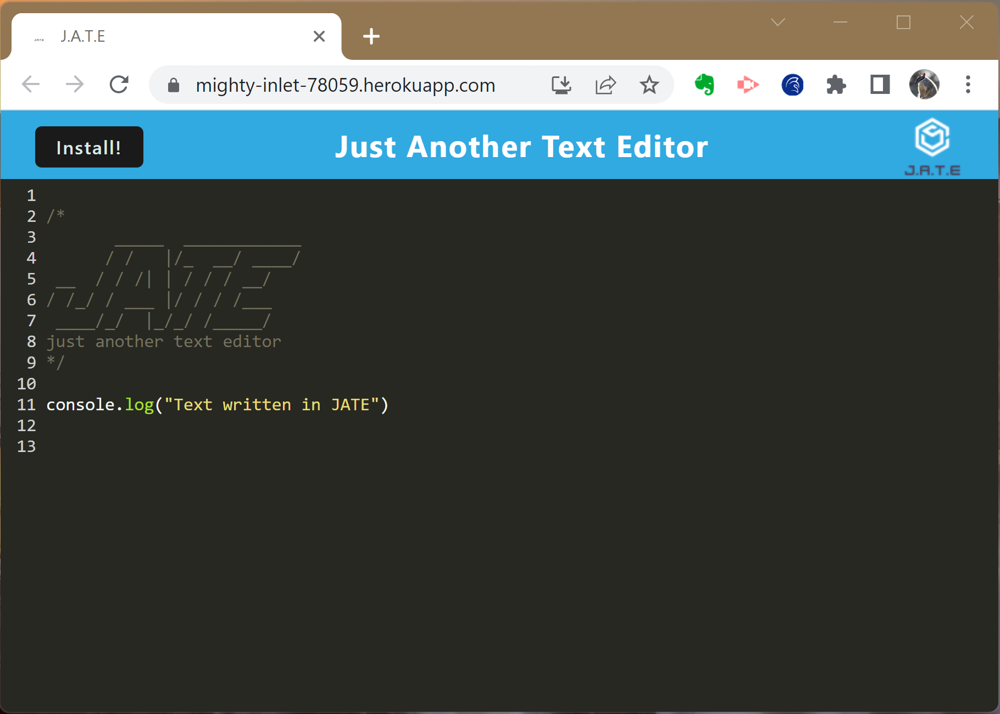
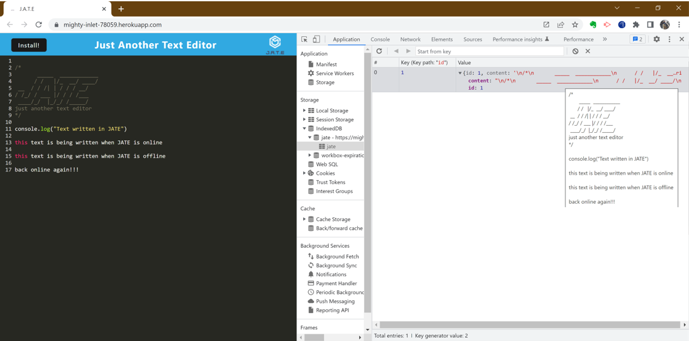
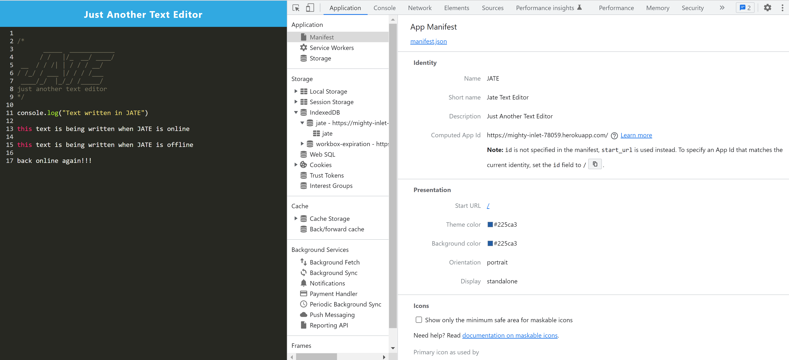
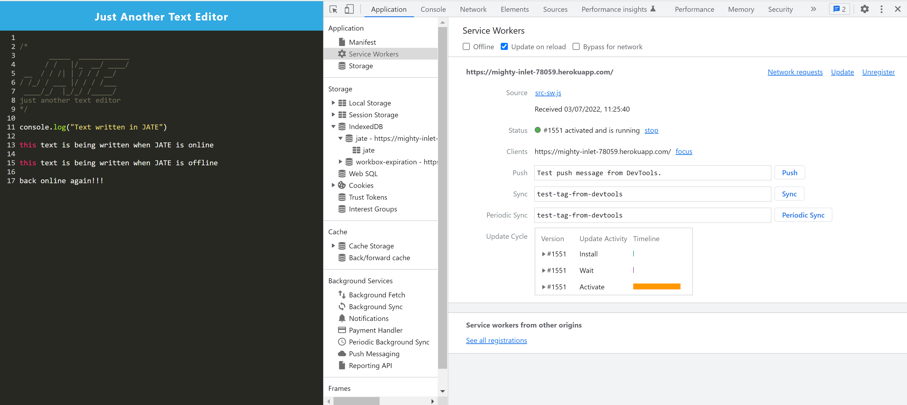

# Just Another Text Editor (JATE)

## Description

The **Just Another Text Editor app** is a single-page full-stack text editor application that meets [Progressive Web App (PWA)](https://web.dev/progressive-web-apps/) criteria. Additionally, it features a number of data persistence techniques that serve as redundancy in case one of the options is not supported by the browser. The app also functions offline.

**Just Another Text Editor app** implements methods for getting and storing data to an [IndexedDB database](https://developer.mozilla.org/en-US/docs/Web/API/IndexedDB_API) using the [IndexedDB API (often abbreviated to IDB)](https://developer.mozilla.org/en-US/docs/Web/API/IndexedDB_API). The [IDB package](https://www.npmjs.com/package/idb) is a lightweight wrapper around the IndexedDB featuring a number of methods for storing and retrieving data. 

The app is deployed to [Heroku](https://mighty-inlet-78059.herokuapp.com/), with the code available on [GitHub](https://github.com/grace-anderson/text-editor)

## Table of Contents

- [Just Another Text Editor (JATE)](#just-another-text-editor-jate)
  - [Description](#description)
  - [Table of Contents](#table-of-contents)
  - [Technologies](#technologies)
  - [Usage](#usage)
  - [Functionality](#functionality)
  - [Installation](#installation)
  - [Contribution Guidelines](#contribution-guidelines)
  - [Demo](#demo)
  - [License](#license)

## Technologies

This application uses the following technologies:

**Dependencies**
* [code-mirror-themes](https://www.npmjs.com/package/code-mirror-themes)
* [express.js](https://www.npmjs.com/package/express)
* [idb](https://www.npmjs.com/package/idb)
* [if-env](https://www.npmjs.com/package/if-env)
* [node.js](https://nodejs.dev/)

**Dev dependencies**
* [@babel/core](https://www.npmjs.com/package/@babel/core)
* [@babel/plugin-transform-runtime](https://www.npmjs.com/package/@babel/plugin-transform-runtime),
* [@babel/preset-env](https://www.npmjs.com/package/@babel/preset-env)
* [@babel/runtime](https://www.npmjs.com/package/@babel/runtime)
* [babel-loader](https://www.npmjs.com/package/babel-loader)
* [concurrently](https://www.npmjs.com/package/concurrently)
* [css-loader](https://www.npmjs.com/package/css-loader)
* [eslint](https://www.npmjs.com/package/eslint)
* [eslint-config-prettier](https://www.npmjs.com/package/eslint-config-prettier)
* [html-webpack-plugin](https://www.npmjs.com/package/html-webpack-plugin)
* [http-server](https://www.npmjs.com/package/http-server)
* [nodemon](https://www.npmjs.com/package/nodemon)
* [prettier](https://www.npmjs.com/package/prettier)
* [style-loader](https://www.npmjs.com/package/style-loader)
* [webpack](https://www.npmjs.com/package/webpack)
* [webpack-cli](https://www.npmjs.com/package/webpack-cli)
* [webpack-dev-server](https://www.npmjs.com/package/webpack-dev-server)
* [webpack-pwa-manifest](https://www.npmjs.com/package/webpack-pwa-manifest)
* [workbox-webpack-plugin](https://www.npmjs.com/package/workbox-webpack-plugin)

**Deployment**
* [Heroku](https://www.heroku.com/)
* [Deployed app](https://mighty-inlet-78059.herokuapp.com/)

## Usage

* Access **Just Another Text Editor app** via its [Heroku url](https://mighty-inlet-78059.herokuapp.com/)
* See [Demo](#demo) for more detail about using the app.

## Functionality

**Just Another Text Editor app** provides the following functionality.
* You can create notes or code snippets with or without an internet connection
* The text you enter when the app is online is available when the app goes offline and vice versa
* You can retrieve notes or code snippets which are saved in the browser using the indexDB database
* You can choose to install the app locally (see [Demo](#demo)) or simply continue to use in the browser 

## Installation
To install and run the **Just Another Text Editor** application code locally,
* Download or clone the code from the [GitHub repository](https://github.com/grace-anderson/text-editor)
  * run ``npm run install`` in the root directory of the project to install  dependencies
  * run ``npm run build`` in the root directory of the project to build the application
  * run ``npm run start`` from the root directory to start the server
  * navigate to your browser, and open the app locally with url ``localhost:3000``
* See the comments in the package.json file for more detail about the scripts to install, build and run the application
* See the [Demo](#demo) section below for more detail about using the app 

## Contribution Guidelines

* Contributions are welcome.
* The code is located in this [GitHub](https://github.com/grace-anderson/text-editor) repo
* To contribute, open a new issue describing your proposed enhancement or fix.
  * Before contributing, browse through open issues to see if your issue already exists or if there is an issue or enhancement you could to solve. 
  * If you're a newbie dev, start contributing by looking for issues labelled "good first issue"
* It is good practice to set up your project repository as an "upstream" remote and synchronize with the project repository
  * Don't update the main branch. Rather create your own branch using a brief descriptive name and make your changes there
* You can create pull requests, but only admins can review and merge.
  * Be nice to your reviewer by adding adding a plain English explanation of your pull request and how your updates addresses the issue/s or enhancements  
* Also see the [GitHub Community Guidelines](https://docs.github.com/en/site-policy/github-terms/github-community-guidelines)

## Demo

TODO - add demo
1. **Just Another Text Editor (JATE)** opened in the browser at deployed [Heroku url](https://mighty-inlet-78059.herokuapp.com/)

2. JATE being installed locally, showing manifest window and shortcut.

3. Demo of JATE retaining data when switching between on and offline

4. Screenshot of indexDB showing data retained when app offline 

5. Screenshot of JATE's app manifest window

6. Screenshot of JATE's service workers window

## License

© 2022 [Helen Anderson](https://github.com/grace-anderson) 

This project is licensed under the [MIT License](https://opensource.org/licenses/MIT).

